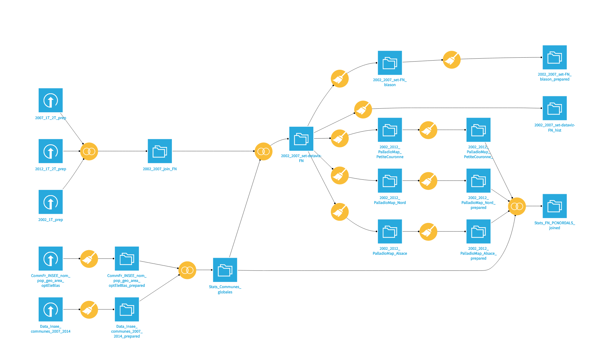

# Datavisualisation : élections présidentielles françaises (2002-2012)

:bulb: Projet de datavisualisation des résultats des élections présidentielles françaises de 2002, 2007 et 2012 à partir des données collectées sur [data.gouv.fr](https://www.data.gouv.fr/fr/).

:mortar_board: Réalisé dans le cadre du cours de data science du Master 2 « Technologies numériques appliquées à l'histoire » de l'École nationale des chartes ([@Chartes-TNAH](https://github.com/Chartes-TNAH)).

:bust_in_silhouette: [@Lucaterre](https://github.com/Lucaterre), [@egray523](https://github.com/egray523), [@jeandamien-genero](https://github.com/jeandamien-genero).

## :open_file_folder: Arborescence

```
Elections_presidentielles_FR-dataviz/
	|
	├── Dataset/
	│    ├── ensemble des sources CSV
	|    |── elections_results_2002-2017/
	|        |── .csv issus de la préparation sur Dataiku des data originelles
	|        |── origin_data/
	|            |── data originelles issues de data.gouv.fr
	│   
	├── Dataviz/
	│    ├── blasons/
	|        |── json et captures d'écran de la visualisation de la galerie des blasons
	│    ├── maps/
	|        |── Alsace/
	|            |── json et captures d'écran des cartes de visualisation des résultats en Alsace
	|        |── NordPasdeCalais/
	|            |── json et captures d'écran des cartes de visualisation des résultats dans le
	|					Nord-Pas-de-Calais
	|        |── ParisPetiteCouronne/
	|            |── json et captures d'écran des cartes de visualisation des résultats dans Paris 
	|					et la petite couronne
	│    ├── process_diagrams/
	│         |── diagrammes sur les résultats
	│     
	├── Export du projet (flow) Dataiku 
	│
	├── ELECTIONS_MASHUP.zip : recettes Dataiku
	|
```
## :scroll: Données d'origine

Le projet s'appuie sur des jeux de données des élections issus de [data.gouv.fr](https://www.data.gouv.fr/fr/) produits par le  [Ministère de l'Intérieur](https://www.data.gouv.fr/fr/posts/les-donnees-des-elections) et de l'[INSEE](https://www.data.gouv.fr/fr/datasets/data-insee-sur-les-communes/). Il s'agit des résultats des élections présidentielles de 2002, 2007 et 2012 et de données socio-économiques des communes, collectés sous la forme de CSV.

Nous avons également effectué des requêtes ```SPARQL``` sur le [Wikidata Query Service](https://query.wikidata.org/) afin d'otenir des CSV avec les noms des candidats et leurs partis pour chaque élection, et une liste des communes françaises accompagnées de leur code INSEE, leurs coordonnées géographiques et leur blason.

Nous avons choisi de travailler avec les résultats par communes pour un voir des jeux de données suffisamment grands (environ 36000 communes en France sur la période [selon Wikipedia](https://fr.wikipedia.org/wiki/Nombre_de_communes_en_France#Jusque_fin_2005)).

## :gear: Préparation

Les données ont été préparées et croisées à l'aide de la plateforme Dataiku.



```parler des différentes étapes de préparation (d'abord ordi de JD puis celui de Lucas)```

## :memo: Limites des données

```parler des limites de nos préparations (statistiques)```

## :art: Visualisations

Les datavisualisations ont été préparées sur les plateformes Dataiku et Palladio.

```décrire chaque visualisation```

