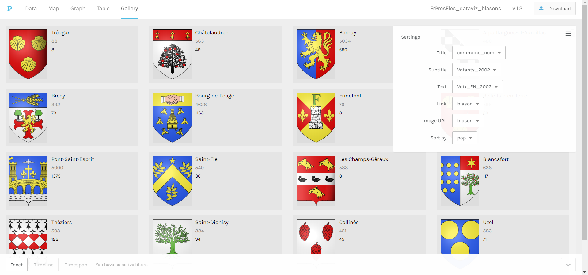
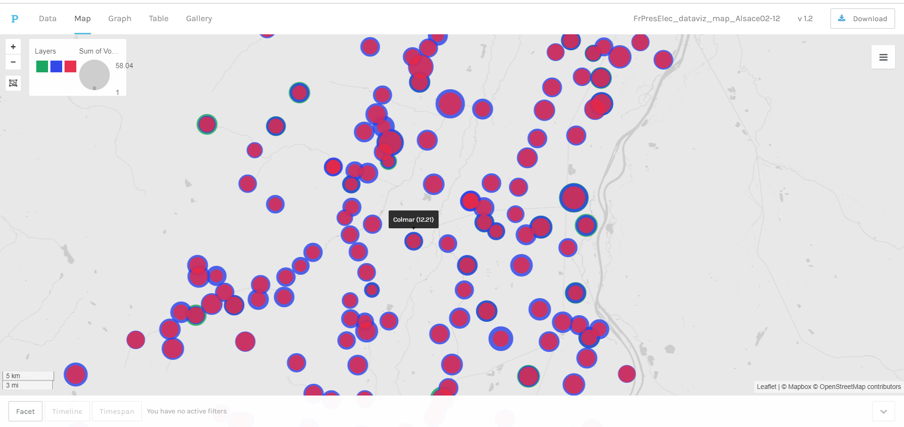
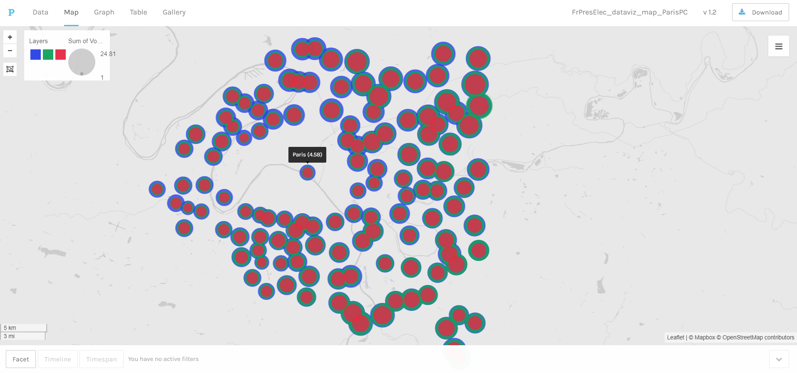

# Datavisualisations : la montée de l'extrême droite aux élections présidentielles françaises de 2002 à 2012

:bulb: Projet de datavisualisation des résultats des élections présidentielles françaises de 2002, 2007 et 2012 à partir des données collectées sur [data.gouv.fr](https://www.data.gouv.fr/fr/).

:mortar_board: Réalisé dans le cadre du cours de data science du Master 2 « Technologies numériques appliquées à l'histoire » de l'École nationale des chartes ([@Chartes-TNAH](https://github.com/Chartes-TNAH)).

:bust_in_silhouette: [@Lucaterre](https://github.com/Lucaterre), [@egray523](https://github.com/egray523), [@jeandamien-genero](https://github.com/jeandamien-genero).

## :open_file_folder: Arborescence

```
Elections_presidentielles_FR-dataviz/
	|
	├── Dataset/
	|    |──INSEE_data_socioeco : données socio-économiques issues de insee.fr
	|    |
	|    |── data_gouv_resultats_elections : csv issus de la préparation sur Dataiku des data originelles
	|    |   |── origin_data/
	|    |
 	|    |── wikidata_requests_SPARQL : requêtes SPARQL effectuées sur Wikidata Query Service et leurs résultats
	│   
	├── Dataviz/
	│    ├── blasons/
	|    |   |── 2002/
	|    |   |    |── json et captures d'écran de la visualisation de la galerie des blasons pour 2002
	|    |   |
	|    |   |── 2007/
	|    |   |    |── json et captures d'écran de la visualisation de la galerie des blasons pour 2007
	|    |   |
	|    |   |── 2012/
	|    |        |── json et captures d'écran de la visualisation de la galerie des blasons pour 2012
	|    |
	│    ├── map/
	|    |   |── Alsace/
	|    |   |    |── json et captures d'écran des cartes de visualisation des résultats en Alsace
	|    |   |
	|    |   |── NordPasdeCalais/
	|    |   |    |── json et captures d'écran des cartes de visualisation des résultats dans le Nord-Pas-de-Calais
	|    |   |
	|    |   |── ParisPetiteCouronne/
	|    |   |    |── json et captures d'écran des cartes de visualisation des résultats dans Paris et la petite couronne
	│    |   |
	|    |   ├── process_diagrams/
	│    |       |── diagrammes sur les résultats
	│     
	├── ELECTIONS_MASHUP.zip : recettes Dataiku
	|
```
## :scroll: Données d'origine

Le projet s'appuie sur des jeux de données des élections issus de [data.gouv.fr](https://www.data.gouv.fr/fr/) produits par le  [Ministère de l'Intérieur](https://www.data.gouv.fr/fr/posts/les-donnees-des-elections) et de l'[INSEE](https://www.data.gouv.fr/fr/datasets/data-insee-sur-les-communes/). Il s'agit des résultats des élections présidentielles de 2002, 2007 et 2012 et des données socio-économiques sur les communes, collectés sous la forme de CSV.

Nous avons également effectué des requêtes ```SPARQL``` sur le [Wikidata Query Service](https://query.wikidata.org/) ([lien](https://github.com/Lucaterre/Elections_presidentielles_FR-dataviz/blob/master/dataset/wikidata_requests_SPARQL/sparql_req)) afin d'otenir des CSV avec les noms des candidats et leurs partis pour chaque élection, et une liste des communes françaises accompagnées de leur code INSEE, leurs coordonnées géographiques et leur blason.

Nous avons choisi de travailler avec les résultats par communes au premier tour pour un avoir des jeux de données suffisamment grands (environ 36000 communes en France sur la période selon [Wikipedia](https://fr.wikipedia.org/wiki/Nombre_de_communes_en_France#Jusque_fin_2005)).

## :gear: Préparation

Les données ont été préparées et croisées à l'aide de la plateforme Dataiku.


Les recettes utilisées pour la préparation des données sont disponibles dans le fichier [ELECTIONS_MASHUP.zip](https://github.com/Lucaterre/Elections_presidentielles_FR-dataviz/blob/master/ELECTIONS_MASHUP.zip).


## :art: Visualisations

Les datavisualisations ont été préparées sur les plateformes Dataiku et Palladio.

### Blasons



Le but de ces trois dataviz préparées sur Palladio est de montrer le nombre des voix exprimées pour le Front national dans une commune pour une élection donnée. Elles contiennent chacune le nom de la commune, le nombre total de votant et le nombre de voix du Front national dans la commune. Ces données font face au blason de la commune, figurée par son url dans le csv d'origine. Les entrées sont triées en fonction de la population des communes. Chaque entrée comporte donc :

| Image    | Données                       |
|----------|-------------------------------|
| Blason   | Nom de la commune             |
|	   | Votants année                 |
|	   | Votants Front national année  |


### Cartes




Les cartes, également préparées sur Palladio, montrent l’évolution du vote en faveur du Front national de 2002 à 2012.

Les résultats de 2002 sont en bleu, ceux de 2007 en rouge, et ceux de 2012 en vert. Les coordonnées géographiques tirées de Wikidata nous ont permis de placer chaque commune de manière précise, avec son nom dans le tooltip. La représentation de chaque commune est conditionnée par le pourcentage de voix obtenu par le FN. 

Les cartes montrent que les élections où le FN a remporté le plus de voix au premier tour sont celles de 2002, suivies par celles de 2012, tandis qu'une baisse signifiante s'observe en 2007. La crise économique de 2008 a pu avoir un effet sur la remontée du FN. Les visualisation montrent également que le FN remporte moins de voix dans les grandes communes. Par exemple, Colmar (Haut-Rhin) a un taux de vote pour le Front national moins important que ses communes limitrophes plus petites.



Le taux de vote pour le Front national est bien moins important à Paris que dans les communes plus éloignées de la capitale. Le taux de vote pour le FN en 2012 approche, et même, surpasse celui de 2002 dans les communes éloignées à l’ouest de Paris.

### Diagrammes

Nous avons également souhaité tester l'option charts de Dataiku afin de produire des diagrammes statistiques. Les indicateurs socio-économiques de l'INSEE ont été mis en relation avec les votes exprimés pour le FN : 

- Total des votes exprimés pour le Front National au 1er tour en fonction de l'orientation économique des communes du Nord, de l'Alsace et de la petite couronne parisienne, 2002-2012.

- Moyenne des voix exprimées pour le FN (en %) en fonction des départements du Nord, de l'Alsace et de la petite couronne parisienne, 2002-2012.

## :memo: Limites des données

### Dataset de data.gouv.fr

- Le ministère de l'Intérieur n'a pas construit le dataset de 2017 de la même manière que les précédents, c'est pourquoi nous n'avons pas pu effuctuer une jointure entre eux. Dans les fichiers de 2002 à 2012, les résultats sont présentés en fonction des candidats ; en 2017, le colonnes sont remplis en fonction du classement des candidats.

- Nous n'avons pas utiliser les résultats des deuxièmes tours car le candidat FN n'y a pas accédé en 2007.

### Blasons

- Nous n'avons utilisé que les données des communes possédant un blason sur Wikidata, soit 5972 entrées.

- L'utilisateur peut identifier une commune grâce à son blason. Malheureusement, Palladio impose un schéma title – subtitle – text, qui s'est avéré contraingnant pour nous. En effet, nous aurions souhaité faire une seule gallerie pour les résultats des trois élections, mais le schéma nous a contraint à en faire une par élection.

### Cartes

- La visualisation comportait trop de bruit avec les données sur l'ensemble des communes françaises.

- Nous avons donc fait le choix de limiter les visualisation à trois régions pour faciliter la manipulation des données : Paris et les trois départements de la petite couronne (Hauts de Seine, Seine Saint-Denis, et Val de Marne), l’Alsace et le Nord-Pas-de-Calais. Ce choix a été motivé par le fait que Paris est une région avec peu de votants pour le FN, et l’Alsace et le Nord-Pas-de-Calais ayant à l'inverse des taux de votes élevées par rapport le reste de la France.

### Diagrammes

- Nous nous sommes également limités aux trois mêmes zones que les cartes pour obtenir des visualisations correctes.

- Les champs du dataset des données socio-économiques étant inégalement remplis, la seule visualisation réalisée sur l'ensemble des communes utilise leur orientation économique (bassin urbain, bassin résidentiel, bassin industriel, etc).

- L'outil charts Dataiku n'affiche pas les données brutes, mais des sommes (sum) ou des moyennes (avrg). Avec certains indices socio-économiques (par ex. le taux d'étudiant par commune), les visualisations étaient donc faussées et ne permettaient pas une lecture statistique correcte. 
